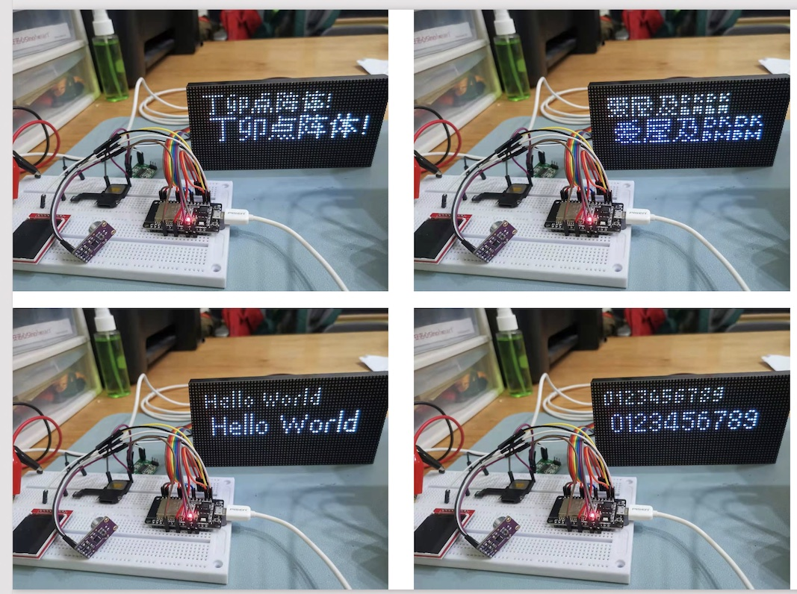

# 支持UTF8的改动说明


### 效果




### 主要改动

新增一个字体类型 uufont_t，定义位于uufont.h

```cpp
/* 
	新增一个设置uufont字体的方法，在设置这类字体后。
	Adafruit_GFX::printXX系列的将优先使用该字体进行绘制。
	从而实现对utf8的支持，具体修改请看代码部分
*/
void Adafruit_GFX::setUUFont(const uufont_t *f = NULL);
```
##### （一）修改以下文件
- Adafruit_GFX.h
- Adafruit_GFX.cpp

##### （二）新增以下文件
- uufont.h
- uufont.cpp

##### （三）新增两个字体文件
- Fonts/Dinkie7_8pt.h  丁卯点阵体试用版 (字体大小 (80.332KB),  glyphs: 2574)
- Fonts/Dinkie9_10pt.h 丁卯点阵体试用版 (字体大小 (90.128KB),  glyphs: 2574)

### 参考

- https://github.com/adafruit/Adafruit-GFX-Library
- https://github.com/adafruit/Adafruit-GFX-Library/pull/244
- [https://github.com/joeycastillo/Adafruit-GFX-Library](https://github.com/joeycastillo/Adafruit-GFX-Library)
- [BillyDonahue/utf8_decoder.cpp](https://gist.github.com/BillyDonahue/232420eb6eeeee4130c7803c4d59f1bd)


### 测试代码

```c
#include <Arduino.h>
#include "gfxfont.h"
#include "uufont.h"
#include "Fonts/dinkie7_8pt.h"
#include "Fonts/dinkie9_10pt.h"
#include "Fonts/FreeMono9pt7b.h"

#define PxMATRIX_MAX_WIDTH 64
#define PxMATRIX_MAX_HEIGHT 32
#define double_buffer
#include <PxMatrix.h>

#define DRAW_TIME   15
hw_timer_t * timer = NULL;
portMUX_TYPE timerMux = portMUX_INITIALIZER_UNLOCKED;
TaskHandle_t displayUpdateTaskHandle = NULL;

#define LED_P_LAT 22
#define LED_P_A 19
#define LED_P_B 23
#define LED_P_C 18
#define LED_P_D 5
#define LED_P_E 15
#define LED_P_OE 16


PxMATRIX dp(64,32,LED_P_LAT, LED_P_OE,LED_P_A,LED_P_B,LED_P_C,LED_P_D);
uint16_t clrDark = dp.color565(32, 32, 32);
uint16_t clrBlue = dp.color565(48, 52, 109);

void DisplayUpdateTask(void *) {
  while(true) {
    if (ulTaskNotifyTake( pdTRUE, portMAX_DELAY))
      dp.display(DRAW_TIME);
  }
}

void IRAM_ATTR display_updater(){
  portENTER_CRITICAL_ISR(&timerMux);
  BaseType_t xHigherPriorityTaskWoken = pdFALSE;
  vTaskNotifyGiveFromISR(displayUpdateTaskHandle, &xHigherPriorityTaskWoken);
  if(xHigherPriorityTaskWoken)
    portYIELD_FROM_ISR();
  portEXIT_CRITICAL_ISR(&timerMux);
}

void display_update_enable(bool is_enable){
  if (is_enable){
    timer = timerBegin(0, 80, true);
    timerAttachInterrupt(timer, &display_updater, true);
    timerAlarmWrite(timer, 4000, true);
    timerAlarmEnable(timer);
  }else{
    timerDetachInterrupt(timer);
    timerAlarmDisable(timer);
  }
}

void setup() {
  Serial.begin(115200);
  dp.begin(16);
  dp.setColorOrder(RRBBGG);
  dp.clearDisplay();
  dp.setBrightness(255);
  xTaskCreatePinnedToCore(DisplayUpdateTask, "DisplayTask", 2048, NULL, 3, &displayUpdateTaskHandle, 1);
  display_update_enable(true);
}

void loop(){
  int tick = millis()/2000;

  dp.clearDisplay();
  switch (tick % 5){
  case 0:
    dp.setTextColor(clrDark);
    dp.setUUFont(&Dinkie7demo_8pt);
    dp.setCursor(4, 7);
    dp.print("0123456789");
    dp.setTextColor(clrBlue);
    dp.setUUFont(&Dinkie9demo_10pt);
    dp.setCursor(6, 17);
    dp.print("0123456789");
    dp.setUUFont(NULL);
    dp.setFont(&FreeMono9pt7b);
    dp.setCursor(4, 30);
    dp.print("0123456789");
    break;  
  case 1:
    dp.setTextColor(clrDark);
    dp.setUUFont(&Dinkie7demo_8pt);
    dp.setCursor(5, 8);
    dp.print("Hello World");
    dp.setTextColor(clrBlue);
    dp.setUUFont(&Dinkie9demo_10pt);
    dp.setCursor(7, 18);
    dp.print("Hello World");
    break;  
  case 2:
    dp.setTextColor(clrDark);
    dp.setUUFont(&Dinkie7demo_8pt);
    dp.setCursor(6, 9);
    dp.print("你好，ESP32");
    dp.setTextColor(clrBlue);
    dp.setUUFont(&Dinkie9demo_10pt);
    dp.setCursor(8, 19);
    dp.print("你好，ESP32");
    break;  
  case 3:
    dp.setTextColor(clrDark);
    dp.setUUFont(&Dinkie7demo_8pt);
    dp.setCursor(5, 8);
    dp.print("丁卯点阵体!");
    dp.setTextColor(clrBlue);
    dp.setUUFont(&Dinkie9demo_10pt);
    dp.setCursor(7, 18);
    dp.print("丁卯点阵体!");
    break;  
  case 4:
    dp.setTextColor(clrDark);
    dp.setUUFont(&Dinkie7demo_8pt);
    dp.setCursor(6, 9);
    dp.print("爱屋及呜呜");
    dp.setTextColor(clrBlue);
    dp.setUUFont(&Dinkie9demo_10pt);
    dp.setCursor(8, 19);
    dp.print("爱屋及呜呜");
    break;  
  default:
    break;
  }
  delay(2000);
  dp.showBuffer();
}
```

### 测试2.13-TFT-ST7302代码
```cpp
#include <Arduino.h>
#include "Adafruit_ST7302.h"
#include "uufont.h"
#include "Fonts/dinkie9_10pt.h"


#define SCLK_PIN    14
#define SID_PIN     13
#define RST_PIN     27
#define DC_PIN      15
#define CS_PIN      2

Adafruit_ST7302 screen(SID_PIN, SCLK_PIN, DC_PIN, RST_PIN, CS_PIN);

void setup() {
  // put your setup code here, to run once:
  Serial.begin(115200);
  Serial.println("set up screen");
  screen.begin(26000000);
  Serial.println("screen inited");
  screen.setTextColor(0x1010);
  screen.setUUFont(&Dinkie9demo_10pt);
  screen.setTextSize(2);
}


static void drawTimeCounter(uint32_t ts_now, uint32_t freq, uint32_t loop_freq){
  int32_t hour = (ts_now / 3600000) % 24;
  int32_t min = (ts_now % 3600000) / 60000;
  int32_t sec = (ts_now % 60000) / 1000;
  int32_t msec = ts_now % 1000;

  screen.clearDisplay();
  screen.drawRoundRect(10, 10, 230, 100, 16, 0x11);
  screen.setCursor(20, 30);
  screen.printf("计时,%02d,%02d,%02d.%03d", hour, min, sec, msec);
  screen.setCursor(20, 50);
  screen.printf("FREQ, %dHz, %dHz", freq, loop_freq);
  screen.display();
}

void loop() {
  // put your main code here, to run repeatedly:
  static uint32_t ts_next = 0, ts_clear_count = 0, frame_count = 0, freq = 0, loop_count = 0, loop_freq = 0;
  uint32_t ts_now = millis();
  loop_count++;
  if(ts_now > ts_next){
    ts_next = ts_now + 50;
    frame_count++;
    drawTimeCounter(ts_now, freq, loop_freq);
  }
  if(ts_now > ts_clear_count){
    freq = frame_count / 5;
    loop_freq = loop_count / 5;
    frame_count = 0;
    loop_count = 0;
    ts_clear_count = ts_now + 5000;
  }
  delay(1);
}

